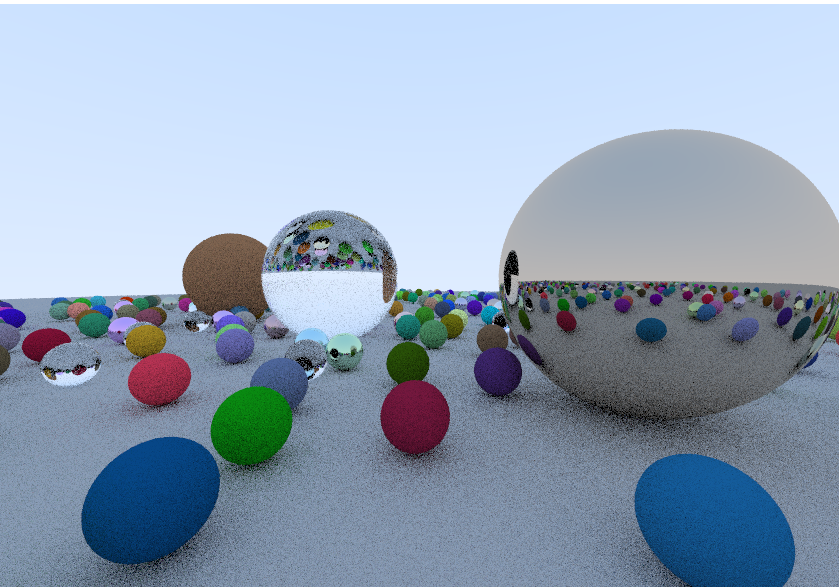

## Raytracer

This is an implementation of the tutorial [Raytracing one weekend](https://raytracing.github.io/books/RayTracingInOneWeekend.html#overview)
in Rust.  

I finished the first book, now working on [The Next Week](https://raytracing.github.io/books/RayTracingTheNextWeek.html).

